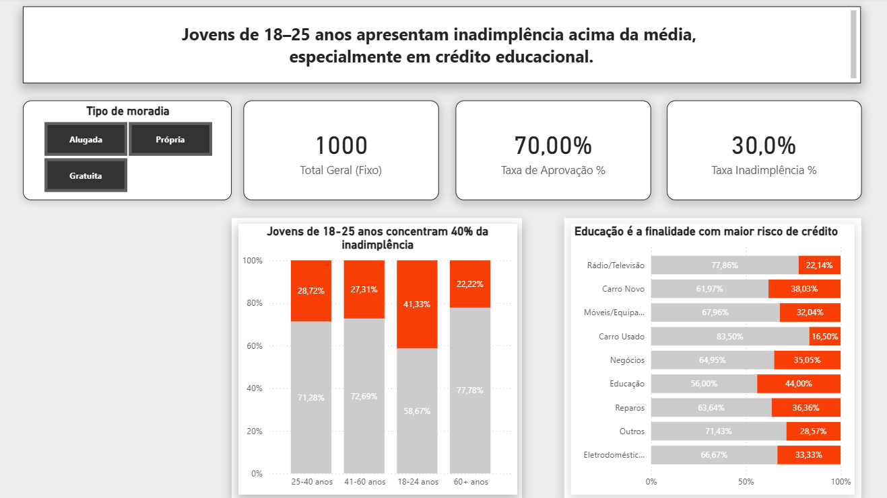

# 💳 Análise de Risco de Crédito | Gestão de Carteira German Credit

Este projeto apresenta uma análise diagnóstica de risco para subsidiar decisões de concessão de crédito. A metodologia utiliza **SQL** para processamento e validação de dados, integrada ao **Power BI** para detecção de anomalias e visualização de indicadores de performance (KPIs).

  

## 🚀 Etapas do Projeto

* **Ingestão de Dados:** Script em Python para automatizar a carga do dataset bruto em um banco SQLite.
* **Tratamento e Padronização:** Limpeza dos dados e tradução de variáveis técnicas para o português utilizando SQL.
* **Análise Diagnóstica:** Utilização de queries SQL para validação de hipóteses e segmentação de risco por perfil do cliente.
* **Data Visualization:** Construção de dashboard interativo no Power BI para monitoramento de KPIs e identificação visual de clusters de risco.

## 📊 Principais Indicadores e Resultados

* **Taxa Global de Inadimplência:** 30,0%.
* **Segmento Crítico:** A categoria **Educação** registra o maior índice de risco (**44,0%**).
* **Fator Etário:** Clientes entre 18–24 anos (41,3%) apresentam o dobro do risco de clientes 60+ (22,2%).
* **Preditores de Solvência:** Clientes com **casa própria** apresentaram a menor taxa de inadimplência (**26,1%**), confirmando a estabilidade residencial como indicador de baixo risco.

## 🔍 Investigação de Anomalia na Política de Concessão

Durante a etapa de visualização, identificou-se uma anomalia crítica através do cruzamento de variáveis habitacionais e etárias:

* **Detecção:** Clientes entre **41-60 anos em Moradia Gratuita** apresentam uma taxa de inadimplência de **41,1%**, superando grupos historicamente mais voláteis.
* **Causa Raiz (Validada via SQL):** Identificou-se que o banco aprovou para este nicho um **Ticket Médio 85% superior** à média da carteira, especificamente para a aquisição de **Veículos Novos (72,7% de default)**.
* **Conclusão Técnica:** A ausência de colateral (imóvel próprio) somada a uma exposição financeira elevada (alavancagem excessiva) resultou em uma severa deterioração da qualidade do crédito neste segmento.

## 🛠 Stack Tecnológica

* **SQL (SQLite):** Engenharia de dados e validação técnica de hipóteses.
* **Power BI & DAX:** Dashboards interativos e medidas de performance.
* **Python:** Automação da carga e tratamento inicial de dados.

## 📂 Estrutura do Repositório

* `/data`: Base de dados original (CSV).
* `/database`: Ambiente SQLite e esquemas de tabelas.
* `/sql`: Consultas de tratamento e análise diagnóstica.
* `/scripts`: Código em Python para automação da carga.
* `/dashboard`: Arquivo `.pbix` e imagem de visualização do painel.

## 📌 Próximos Passos

* Desenvolvimento de um modelo de **Machine Learning (Classificação)** para cálculo da **Probabilidade de Default (PD)**.
* Implementação de uma **Matriz de Confusão** para avaliar a sensibilidade e precisão do modelo na identificação de clientes de alto risco.

---
**Desenvolvido por:** Camila Neri.