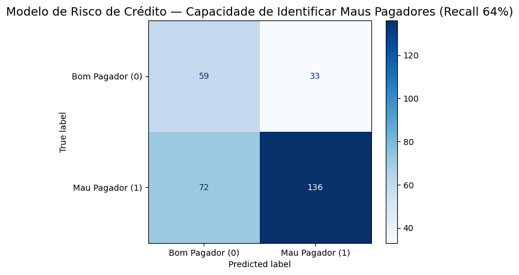

# 💳 Análise de Risco de Crédito | SQL, Power BI & Machine Learning

Este projeto apresenta uma solução completa ("End-to-End") para **subsidiar decisões de concessão de crédito**. A metodologia integra **SQL e Power BI** para o diagnóstico de carteira (KPIs e anomalias) e avança para **Python (Machine Learning)** com a construção de um modelo preditivo para identificar inadimplência.

🎥 **[Clique aqui para ver a demonstração em vídeo no LinkedIn](https://www.linkedin.com/feed/update/urn:li:activity:7419725523129409537/)**

---

## 🚀 Evolução do Projeto

1.  **Ingestão de Dados:** Script em Python para automatizar a carga do dataset bruto em um banco SQLite.
2.  **Análise Diagnóstica (SQL & Power BI):** Validação de hipóteses e identificação de perfis de risco históricos.
3.  **Modelagem Preditiva (Python):** Treinamento de algoritmo de Machine Learning para calcular a probabilidade de default.

---

## 📊 Parte 1: Insights do Diagnóstico
*Principais descobertas extraídas via SQL e visualizadas no Power BI:*

* **Taxa Global de Inadimplência:** 30,0%.
* **Segmento Crítico:** A categoria **Educação** registra o maior índice de risco (44,0%).
* **Anomalia Detectada:** Clientes entre 41-60 anos em "Moradia Gratuita" apresentaram taxa de default de **41,1%** devido à aprovação de Ticket Médio alto sem garantia.

  
   
  <em>Visão geral do painel de monitoramento de risco desenvolvido no Power BI</em>

---

## 🤖 Parte 2: Modelagem Preditiva
*Utilizando Python e Scikit-learn, desenvolvi um classificador Random Forest focado em mitigar a exposição ao risco.*

### 🎯 O Desafio de Negócio
Em crédito, o erro mais oneroso não é negar um bom cliente, mas aprovar um cliente que entrará em default. Por isso, o modelo foi otimizado para maximizar o **Recall da classe de Inadimplentes**.

### 📈 Resultados do Modelo (Random Forest)

* **Recall (Eficiência na detecção de Risco): 64%** (De cada 100 casos reais de inadimplência, o modelo identifica 64).
* **Feature Importance:** O modelo revelou que o **Valor do Crédito** e a **Duração do Empréstimo** são os preditores mais fortes.

  
   
  <em>Matriz de Confusão: Performance do modelo na identificação de riscos</em>

---

## 🛠 Stack Tecnológica

* **Python:** Pandas, Scikit-learn, Matplotlib.
* **SQL (SQLite):** Engenharia de dados.
* **Power BI:** Dashboard interativo.

## 📂 Estrutura do Repositório

* `/data`: Base de dados original.
* `/sql`: Consultas de tratamento.
* `/notebooks`: Jupyter Notebooks (EDA e ML).
* `/dashboard`: Arquivo `.pbix` do Power BI.

---
**Desenvolvido por:** Camila Neri