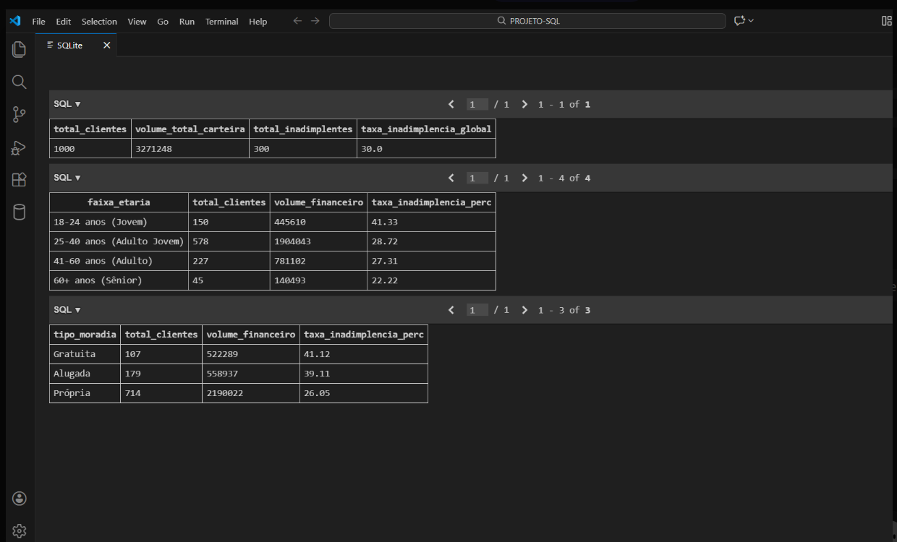

💳 Análise de Risco de Crédito | SQL & Python

Este projeto apresenta uma análise de risco de crédito baseada no **German Credit Dataset**, com foco em apoiar decisões de concessão e mitigação de inadimplência em contextos de **bancos e fintechs**.

O objetivo é transformar dados brutos em **inteligência analítica**, utilizando SQL para validação de hipóteses e identificação de padrões de risco relevantes para a gestão de carteiras de crédito.

---

🚀 Etapas do Projeto

- **Ingestão de Dados**  
  Script em Python para automatizar a carga do dataset em um banco **SQLite**.

- **Tratamento e Padronização**  
  Limpeza dos dados e tradução de variáveis técnicas para o português utilizando SQL.

- **Análise Diagnóstica**  
  Utilização de queries SQL para validação de hipóteses e segmentação de risco por perfil do cliente.

---

📈 Principais Hipóteses e Resultados (via SQL)

A partir das consultas executadas no VS Code, foram identificados os seguintes insights:

- **Taxa de inadimplência global da carteira:** 30,0%.

- **Hipótese 1 – Idade influencia o risco?**  
  Sim. Clientes jovens (18–24 anos) apresentam taxa de inadimplência de **41,3%**, enquanto clientes seniores (60+) apresentam **22,2%**.

- **Hipótese 2 – Estabilidade residencial reduz o risco?**  
  Sim. Clientes com **casa própria** apresentam inadimplência em torno de **26%**, abaixo da média da carteira.

- **Hipótese 3 – A finalidade do crédito importa?**  
  Sim. Empréstimos para **educação** apresentaram a maior taxa de default (**44%**), configurando um segmento crítico da carteira.

O principal aprendizado foi identificar que o risco não está em variáveis isoladas, mas na **combinação entre perfil do cliente e finalidade do crédito**, aspecto central para políticas de concessão e gestão de risco.

---

📊 Resultados das Consultas SQL

Abaixo estão exemplos das principais métricas calculadas diretamente no banco de dados, incluindo inadimplência global, segmentação por faixa etária e tipo de moradia.

---

📂 Estrutura do Repositório

- `/data`  
  Dataset original utilizado na análise.

- `/database`  
  Scripts de carga e banco de dados SQLite.

- `/sql`  
  Queries de análise exploratória e diagnóstica.

- `/docs`  
  Imagens e materiais de apoio ao projeto.

---

🛠 Tecnologias Utilizadas

- SQL (SQLite)  
- Python  
- VS Code  

---

📌 Próximo passo do projeto

Consolidação dos principais indicadores em **dashboards no Power BI**, com foco em monitoramento de inadimplência, exposição ao risco e suporte à tomada de decisão.

Desenvolvido por: Camila Neri.